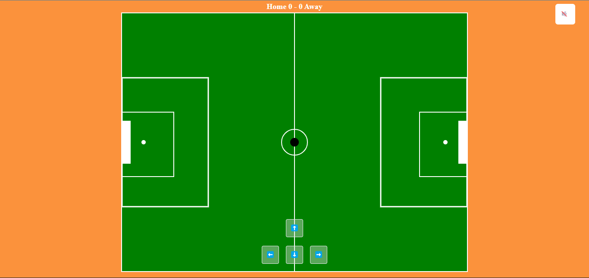
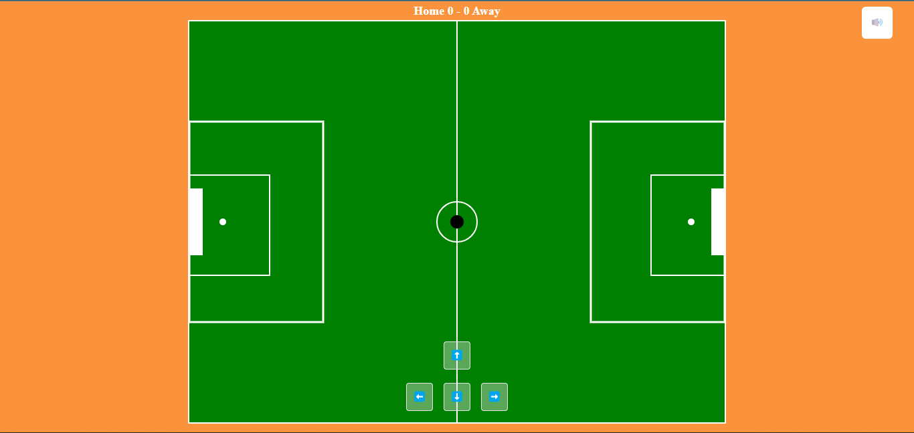
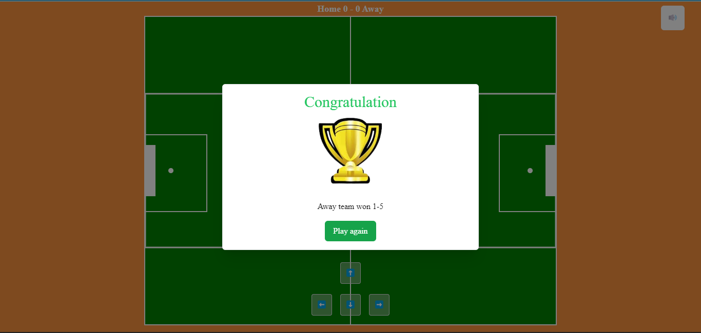

 ## 2D Football Game

This repository contains the code for a football game built using the HTML5 canvas. The game is played on a virtual football field, and the user controls the movement of the football using arrow keys or on-screen buttons. The objective of the game is to score goals by kicking the football into the opponent's goalpost.

### Getting Started

To run the game on your local machine:

1. Clone this repository to your computer by running
```
git clone https://github.com/Lekanjoy/2D-Football-Game.git
```
or download the repository.

2. Install NodeJS if it is not installed already from [here](https://nodejs.org/en/download/).

3. Navigate to the directory where you saved the project files (e.g
`cd /path/to/2D-Football-Game`).
 
4. Run `npm install` in the terminal to install all required dependencies.
5. Once installation is complete, open the folder and  start the server by running
```
npm run watch
``` to run the watch command for the tailwind classes and then open run the html file with the live server extension.
6. Then go to 
```
http://localhost:5500/
```
in your web browser .

### Instructions

To play the game, follow these steps:

1. Open the `index.html` file in your desktop web browser as this game is best suited for larger screens.
2. Use the arrow keys or on-screen buttons or drag the ball to any direction to move the football.
3. Try to score goals by kicking the football into the opponent's goalpost.
4. The game ends when one team scores 5 goals.

### Demo / Screenshots

And here are some screenshots:





### Code Overview

The code for the football game is written in JavaScript and HTML. The main components of the code are:

- The `canvas` element, which represents the football field.
- The `ctx` object, which is used to draw on the canvas.
- The `football` object, which represents the football.
- The `goalPosts` array, which represents the goalposts.
- The `scores` array, which stores the scores of the two teams.
- The `updateGame()` function, which updates the game state.
- The `drawGame()` function, which draws the game on the canvas.
- The `gameLoop()` function, which runs the game loop.

### Step-by-Step Explanation

Here is a step-by-step explanation of the code:

1. The `canvas` element is created and the `ctx` object is obtained.
2. The `footballField` object is created, which stores the dimensions of the football field.
3. The `goalPosts` array is created, which stores the positions of the goalposts.
4. The `leftPenaltyBox` and `rightPenaltyBox` objects are created, which store the positions of the penalty boxes.
5. The `leftPenaltySpot` and `rightPenaltySpot` objects are created, which store the positions of the penalty spots.
6. The `football` object is created, which stores the position and speed of the football.
7. The `scores` array is created, which:
- Initializes with empty arrays representing the scores of both teams `[0, 0]`
- Is updated whenever a goal is scored using the `checkGoal(team)` function.
8. The `gameLoop()` function is called repeatedly using the `requestAnimationFrame()` method.
9. Inside the `updateGame()` function, the following actions occur:
- The `football`'s position is updated based on its velocity.
- If the football hits any walls on the field , it resets the game for a goalkick places the ball back to the middle of the field.
- The `checkGoal(team)` function is called if the ball goes through the opponent goalpost (i.e., if `(ballX + ballRadius) > fieldWidth`).
10. After updating the game state, the `drawGame()` function is called.
11. In the `drawGame()` function, all elements on the canvas are cleared using `ctx.clearRect(0, 0, fieldWidth, fieldHeight)`. Then, the following items are drawn on the canvas:
- The football is drawn using `drawBall()`.
- The goalposts are drawn using `drawGoalPost()`.
- The scores are displayed at the top left corner of the screen using `showScores()`,


### Challenges / Limitations
There were several challenges encountered during this project:
- Adding sounds: Implementing audio was more difficult than expected due to browser limitations. Specifically, chrome does not support audio autoplay in some instance, so I had to make the game sound off until the user gives permission to turn it on.
- Collision detection: Detecting when the ball hits either goalpost or the edge of the field was tricky as it required precise calculations involving vectors.I implemented a simple collision detection calculation that checks if the distance between the center of the ball and one of the posts or the edges is less than half the radius of the ball. If so, a score is awarded to the team whose post was hit and the ball's velocity is reversed.

Overall, developing this game from scratch was an enjoyable experience but presented some challenges that made me research more on HTML5 canvas especially by using the MDN documentation [here](https://developer.mozilla.org/en-US/docs/Web/HTML/Element/canvas) .
